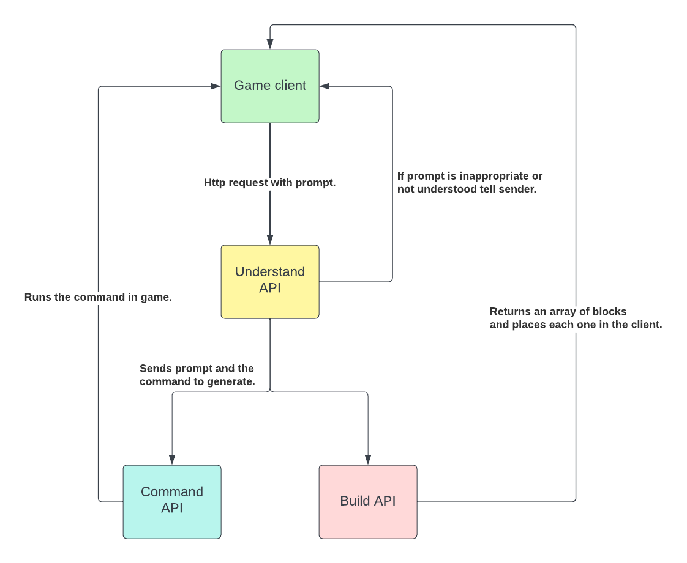

### BlockBuilders AI API Usage Guide

## What is it?
A ChatGPT powered Minecraft expert that can build and write commands for you. 

This is the backbone of BlockBuilder AI (coming soon).

Below is a guide for how to use the APIs, it has a number of scripts to get you going.

### **⚠️ Warning:** The Disclaimers
- This project is not an official Minecraft Product and is not approved by or associated with Mojang or Microsoft. 
- It uses your API keys so you will be charged by Replicate and OpenAI for using it, set limits in your account so it doesn't spend money you don't want it to. 
- Always use a burner API key for this project and any other project you come across. Do not use your primary API key. A burner API key is a temporary key that you can easily revoke or discard after playing with the demo.

## How does it work? 
There are five different APIs that take a prompt as an input and are trained in a particular Minecraft specialism:
- **Builder API** - Builds a Minecraft model from a prompt using Shap-e on Replicate.
- **Understand API** - Understands the intention of the player based on a prompt.
- **Command API** - Returns a Bedrock command based on a prompt.
- **Syntax API** - Returns the correct Bedrock block, entity, or item syntax from a prompt.
- **Target API** - Returns Bedrock target selectors and arguments from a prompt.
  
## Getting Started Guides:
- [Builder API](builder/Builder%20API.md) - How to use the Builder API.
- [Understand API](understand/Understand%20API.md) - How to use the Understand API.
- [Command API](commands/Command%20API.md) - How to use the Command API.
- [Syntax API](syntax/SyntaxAPI.md) - How to use the Syntax API.
- [Target API](target/TargetAPI.md) - How to use the Target API.

## How it is used in BlockBuilder AI

