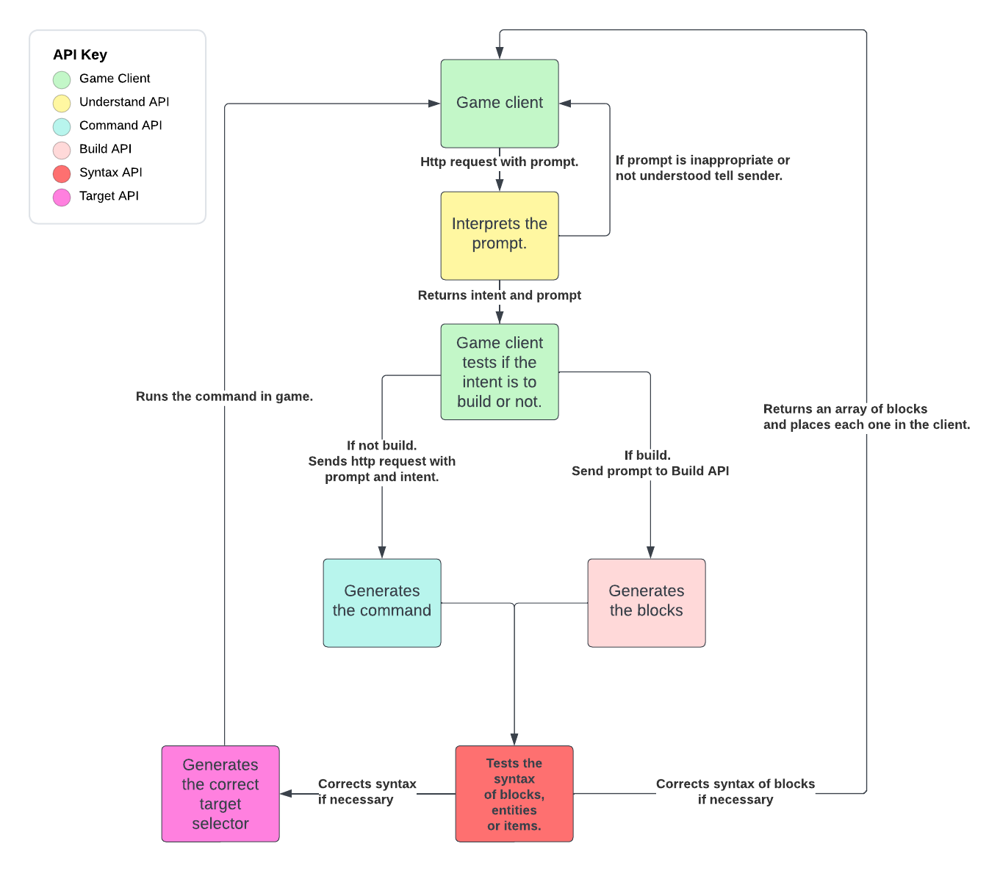

### BlockBuilders AI API Usage Guide
## What is it?

A demo of a series of APIs that are ChatGPT based Minecraft Experts. It can build and write commands for you! 

This is the backbone of BlockBuilder AI (coming soon)

Below is a guide for how to use the APIs it has a number of getting started scripts to give you a headstart for playing with it yourself.

## Getting Started Guides:
- [Builder API](builder/Builder%20API.md) - How to use the Builder API
- [Understand API](understand/Understand%20API.md) - How to use the Understand API
- [Command API](commands/Command%20API.md) - How to use the Command API
- [Build Command API](commands/Build%20Command%20API.md) - How to use the Build Command API
- [Syntax API](syntax/SyntaxAPI.md) - How to use the Syntax API
- [Target API](target/TargetAPI.md) - How to use the Target API
  
## How does it work? 
There are six different APIs that take a prompt as an input and are trained in a particular Minecraft specialism:
- **Builder API** - Builds a Minecraft model from a prompt using Shap-e on Replicate.
- **Understand API** - Understands the intention of the player based on a prompt.
- **Command API** - Returns a Bedrock command based on a prompt.
- **Build Command API** - Returns specific variables for editing the Minecraft model.
- **Syntax API** - Returns the correct Bedrock block, entity, or item syntax from a prompt.
- **Target API** - Returns Bedrock target selectors and arguments from a prompt.

## How it is used in BlockBuilder AI

